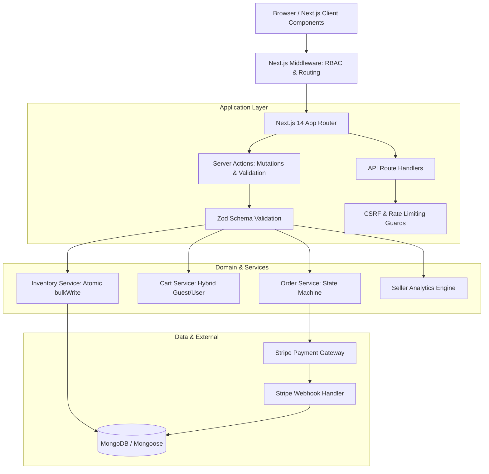

# Shoply — Enterprise Fullstack E-Commerce Platform

[](https://nextjs.org/)
[](https://reactjs.org/)
[](https://www.typescriptlang.org/)
[](https://tailwindcss.com/)
[](https://www.mongodb.com/)
[](https://stripe.com/)
[](https://nodejs.org/)

**Shoply** is a fullstack, multi-tenant e-commerce platform built with Next.js 14 App Router, React 18, TypeScript, and MongoDB. Designed with enterprise-grade software patterns: distributed atomic concurrency control, defensive security architectures, role-based access control (RBAC), and automated testing.

---

## 🌟 Key Architectural Highlights

- **App Router & Server Actions:** Leverages Next.js 14 React Server Components (RSC) for zero-bundle-size rendering, server-side data streaming, and type-safe Server Actions for mutations.
- **Race-Condition Safe Concurrency:** Multi-item inventory operations use MongoDB conditional `$bulkWrite` with atomic `$gte` checks, ensuring zero stock overselling and stock inflation protection during partial failures.
- **Distributed Atomic Rate Limiter:** Database-backed atomic sliding window rate limiting via MongoDB `findOneAndUpdate` with `$inc` and TTL indexes, active across serverless/multi-instance deployments.
- **Defense-In-Depth Security:**
  - Strict CSRF double-submit token verification with constant-time buffer comparison (`crypto.timingSafeEqual`).
  - Cryptographically signed session tokens (JWT) with NextAuth.js; elimination of client-spoofable auth headers.
  - Granular Role-Based Access Control (RBAC) across `CUSTOMER`, `SELLER`, and `ADMIN` tiers.
- **Hybrid Guest & User Cart:** Instant client-side cart experience via Zustand with localStorage persistence for unauthenticated visitors, seamlessly merged into the database upon login.
- **Resilient Webhook Pipeline:** Idempotent Stripe webhook handling with stock reservation tracking, status transition auditing (`OrderStatusHistory`), and transactional cart clearing.
- **Core Web Vitals Optimized:** Complete Next.js `<Image />` optimization across all components with zero layout shift (CLS), `<Suspense>` boundaries on all dynamic query hooks, and zero ESLint errors/warnings.

---

## 🛠️ Tech Stack

| Domain | Technologies |
|---|---|
| **Framework** | Next.js 14.2 (App Router), React 18.3 |
| **Language** | TypeScript 5.4 (Strict Mode, `noUnusedLocals`) |
| **Styling & UI** | Tailwind CSS, Radix UI primitives, Lucide Icons, Sonner |
| **State & Data Fetching** | TanStack Query v5 (React Query), Zustand v5 |
| **Database & ODM** | MongoDB, Mongoose 8 (Connection Pooling & Caching) |
| **Authentication** | NextAuth.js v5 (JWT, Role Claims, Session Management) |
| **Payments** | Stripe API (Checkout Sessions & Webhook Events) |
| **Validation** | Zod (Runtime input validation on actions & API endpoints) |
| **Testing** | Node.js Native Test Runner (`node:test`, `node:assert`, `tsx`) |

---

## 🏗️ System Architecture



---

## 🚀 Getting Started

### Prerequisites
- Node.js 18.17+ or 20+
- MongoDB instance (local or MongoDB Atlas)
- Stripe developer account (optional for local mock testing)

### Installation

1. **Clone the repository:**
   ```bash
   git clone https://github.com/your-username/shoply.git
   cd shoply
   ```

2. **Install dependencies:**
   ```bash
   npm install
   ```

3. **Configure Environment Variables:**
   Copy the example environment configuration:
   ```bash
   cp .env.example .env
   ```
   Fill in your credentials (`DATABASE_URL`, `NEXTAUTH_SECRET`, `STRIPE_SECRET_KEY`, etc.).

4. **Run the Development Server:**
   ```bash
   npm run dev
   ```
   Open [http://localhost:3000](http://localhost:3000) in your browser.

---

## 🧪 Testing & Code Quality

The repository includes a comprehensive automated test suite testing financial mathematics, CSRF safety, state machine transitions, inventory errors, and schema validations:

```bash
# Run automated test suite
npm test

# Run ESLint validation (strict zero-warning check)
npm run lint

# Compile production build & generate static routes
npm run build
```

---

## 📁 Project Structure

```
├── src/
│   ├── actions/          # Type-safe Next.js Server Actions (user, product, cart, order)
│   ├── app/              # Next.js App Router (pages, layouts, dynamic routes, API endpoints)
│   │   ├── admin/        # Admin dashboard & management interfaces
│   │   ├── api/          # REST route handlers & webhook consumers
│   │   ├── cart/         # Shopping cart view with real-time updates
│   │   ├── checkout/     # Checkout workflow & Stripe redirect
│   │   ├── products/     # Catalog browsing, filtering, search, and detail views
│   │   ├── profile/      # User profile, address management & order history
│   │   └── seller/       # Seller portal & product management
│   ├── components/       # Reusable UI component library (shadcn/ui & custom)
│   ├── features/         # Domain-driven feature modules (cart, orders, inventory, seller)
│   ├── lib/              # Core utilities (db, auth, csrf, rateLimit, validators, stripe)
│   ├── models/           # Mongoose schemas & TypeScript document interfaces
│   ├── stores/           # Zustand stores (cart state, guest storage sync)
│   └── types/            # Central domain TypeScript definitions
├── tests/                # Automated unit and integration test specifications
└── public/               # Static assets & placeholders
```

---

## 📄 License

This project is licensed under the MIT License.
